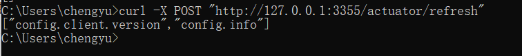

## 一些说明
1. 我们新建配置文件bootstrap.yml，这里为什么不用application.yml呢？
```
application.yml是用户级的资源配置项，而bootstrap.yml是系统级的资源配置项，bootstrap.yml的优先级更高，，SpringCloud会创建一个"Bootstrap Context"，
作为Spring应用的“Application Context"的父上下文。
初始化的时候，“Bootstrap Context"负责从外部源加载配置属性并解析配置，这两个上下文共享一个从外部获取的"Environment”。”Bootstrap“属性有高优先级，
默认情况下，它们不会被本地配置覆盖。
"Bootstrap Context"和"Application Context"这两个上下文有不同的约定，所以新增一个bootstrap.yml文件，保证这两个上下文的配置分离。
```
2. 当我们在GitHub上修改配置文件内容，刷新配置中心服务端Server，发现S服务端erver配置中心立刻响应并刷新了配置信息，但是，我们刷新客户端Client， 
   发现没有任何响应，配置信息仍然是原来的配置信息。总不能每次远端修改了配置文件后，客户端都需要重启来进行对配置信息的重新加载对吧，针对这个问题，
   我们需要使用动态刷新。只需要在客户端Client，加上actuator监控，我们需要在客户端Client的pom文件中加入这个依赖，如下图：
   ```
   <dependency>
   <groupId>org.springframework.boot</groupId>
   <artifactId>spring-boot-starter-actuator</artifactId>
   </dependency>
   ```
   修改bootstrap.yml配置文件，加入如下配置暴露监控断点：
    ```
   # 暴露监控端点
    management:
    endpoints:
    web:
    exposure:
    include: "*"
   ```
   在业务类ConfigClientController上添加@RefreshScope注解使客户端服务具有刷新功能。
   ```
   @RestController
   @RefreshScope
   public class ConfigClientController {
    
        @Value("${config.info}")
        private String configInfo;
     
        @GetMapping("/config")
        public String getConfigInfo() {
            return configInfo;
        }
    }
   ```

   发送POST请求刷新客户端Client该刷新请求必须发送后，客户端才能获得刷新后的信息，刷新客户端的请求必须是POST请求。如下图：
   `curl -X POST "http://127.0.0.1:3355/actuator/refresh"`
   当出现以下信息时说明激活刷新客户端Client成功，再次访问，就可以得到刷新后的配置信息。
   
   
3. 但是假设如果我们有多个微服务客户端呢？难道每个微服务都需要执行一次POST请求进行手动刷新吗？我们可以通过广播的方式进行一次通知，
   处处生效，这里就要下一节要学习的知识消息总线——Spring Cloud Bus。

