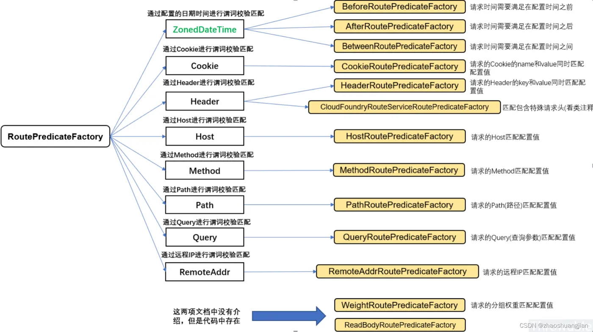
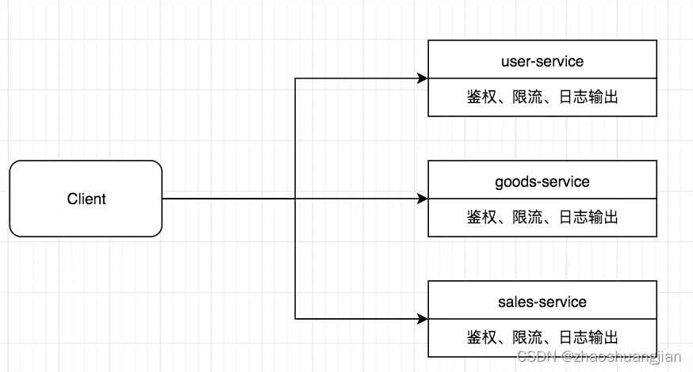
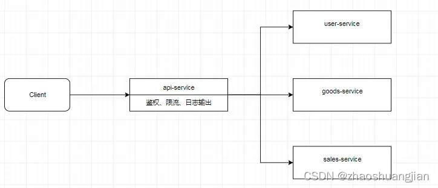

### spring cloud gateway笔记
Spring Cloud Gateway将路由匹配作为Spring WebFlux HandlerMapping基础框架的一部分，它包含许多内置的RoutePredicateFactory，
所有这些Predicate都与HTTP请求的不同属性匹配。多个Route Predicate工厂进行组合。Spring Cloud Gateway 创建Route对象时，
使用RoutePredicateFactory创建Predicate对象，Predicate对象可以赋值给Route，Spring Cloud Gateway包含许多内置的Route Predicate Factoriess。
所有的这些谓词都匹配HTTP的不同属性。多种谓工厂可以组合，并通过逻辑and。

我们常用的路由配置，就是为了实现一组匹配规则，让请求过来找到对应的Route进行处理。如下图:


predicates中配置的After中的时间设置可以根据代码来：
```
public static void main(String[] args) {
    ZonedDateTime time =  ZonedDateTime.now();//使用默认时间
    System.out.println(time);
}
```

像这个After，我们就可以上线新功能的时候使用，比如你公司上线是在晚上10点上线，你可以提前上线，然后等到设置的时间再生效。

#### Filter的作用
当我们有很多个服务时，比如下图中的user-service、goods-service、sales-service等服务，客户端请求各个服务的Api时，每个服务都需要做相同的事情，比如鉴权、限流、日志输出等。

对于这样重复的工作，有没有办法做的更好，答案是肯定的。在微服务的上一层加一个全局的权限控制、限流、日志输出的Api Gatewat服务，
然后再将请求转发到具体的业务服务层。这个Api Gateway服务就是起到一个服务边界的作用，外接的请求访问系统，必须先通过网关层。


Spring Cloud Gateway的Filter种类分为GatewayFilter（单一的）和GlobalFilter（全局的）
Spring Cloud Gateway根据作用范围划分为GatewayFilter和GlobalFilter，二者区别如下：
1. GatewayFilter : 需要通过spring.cloud.routes.filters 配置在具体路由下，只作用在当前路由上或通过spring.cloud.default-filters配置在全局，作用在所有路由上。
2. GlobalFilter : 全局过滤器，不需要在配置文件中配置，作用在所有的路由上，最终通过GatewayFilterAdapter包装成GatewayFilterChain可识别的过滤器，它为请求业务以及路由的URI转换为真实业务服务的请求地址的核心过滤器，不需要配置，系统初始化时加载，并作用在每个路由上。


